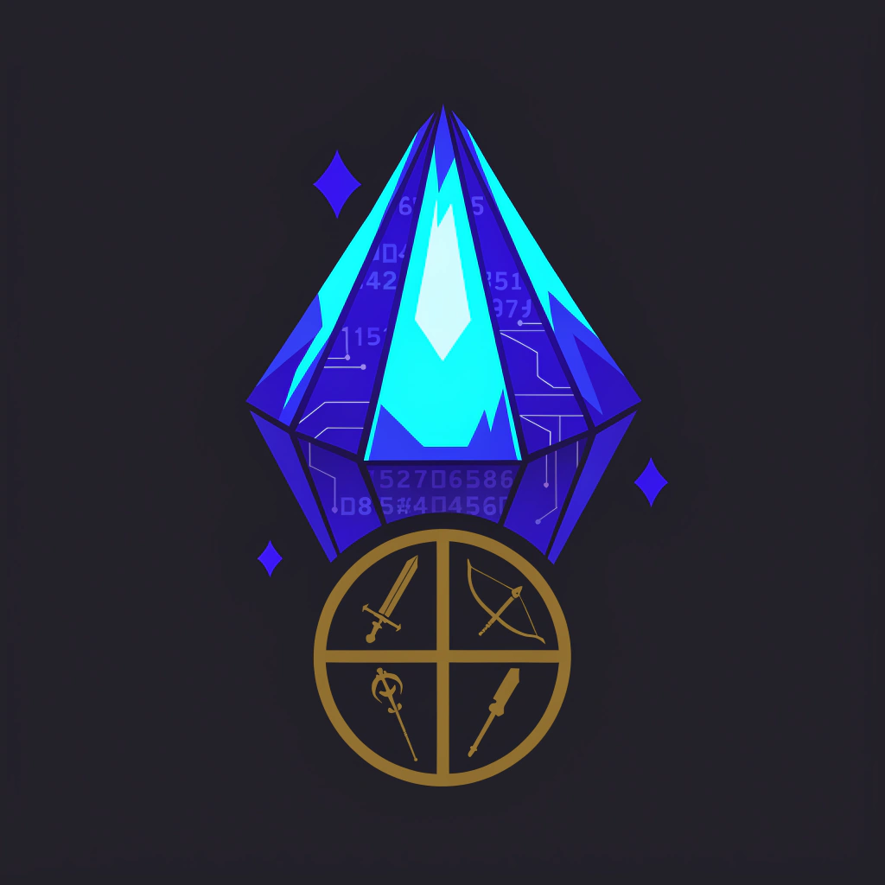
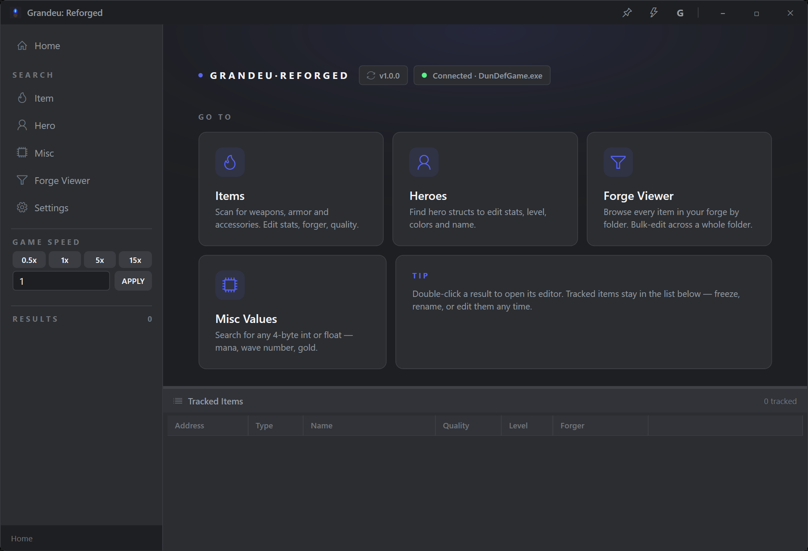

<p align="center">
  
</p>

# Grandeu: Reforged

A memory editor for *Dungeon Defenders 1* (`DunDefGame.exe`) — a WPF rewrite of the original WinForms tool *Grandeu 4.0.0.4*. The shipped binary is `GrandeuReforged.exe`.



## Before you use this

**Not for online or Ranked play.** Ranked stats are validated server-side; using an editor there can get heroes wiped or an account banned. Use it in solo, local or open play only.

**Use at your own risk.** Edits can break the game or your save. The tool backs your save up before it changes anything, but we are not responsible for a broken game or a lost character.

## Features

- **Forge Viewer** — browse your forge inventory and pick items to modify in seconds. Filter by **Source** (All / Forge / Hero) with real folder names, type, quality (including Ultimate 93 / + / ++), and sort.
- **Hero Viewer** — every hero's stats, level and equipped items in one place. Double-click a hero or an item to jump straight into its editor.
- **Max Stat** — one-click max out any item's stats. **Class-aware**: only applies the stats valid for that item and weapon family. Works with Bulk Edit on any mix of item types.
- **Item Dupe** — copy an item's stats onto another item, using the game's own value set for the lowest crash risk.
- **Bulk Edit** — modify many items at once; only the fields you change are written.
- **Auto Kill** — flip a switch to instantly clear enemies from the map. Multiplayer-safe hero protection covers every hero class, including DLC heroes, Summoner pets, and Series EV turrets.
- **Unlimited Mana / Max Tower Units** — in-level title-bar toggles.
- **Game Speed Control** — accelerate the game to blast through levels.
- **Hero Editor** — customize hero stats and appearance, including color.
- **Item Editor** — full control over item stats, affixes, and properties, including a read-only weapon-class indicator.
- **Colour editor** — colour item descriptions and forger names with a visual picker: select the text, click a colour. No tags to type.
- **Hotkeys** — every title-bar toggle (Auto Kill, Automate G, Unlimited Mana, Max Tower Units, Always On Top) can be bound to a key combo in Settings.
- **Error log** — a one-session log you can attach when reporting a problem, next to the COPY REPORT button in Settings → Advanced.
- **Save backups & restore** — your DD1 save (`DunDefHeroes.dun`) is backed up automatically when the tool starts and before the first edit of every session, so any session can be undone. Restore any backup from **Settings → Advanced** (with the game closed).
- **Safe writes** — every edit checks that the item is still the one you selected before writing, so a stale Forge card (item sold or dropped since the scan) is refused instead of overwriting whatever the game put there.
- **Zero-touch game-update recovery** — the tool learns the game's memory addresses from the live game, saves them, and re-learns them automatically after every DD1 patch. No tool update needed on patch day. A guided **FIX MY SETUP** wizard (Settings → Advanced) walks you through it if anything ever looks off.
- **Modern UI** — clean dark theme, sidebar navigation, tooltips everywhere, keyboard-friendly (Enter scans, Escape closes dialogs), touch- and small-screen-friendly scrollbars.

## Build requirements

- **Windows 10 or 11**
- **.NET 8 SDK** — https://dotnet.microsoft.com/download/dotnet/8.0
- No third-party NuGet packages. Only dependencies are WPF and the Windows base class library.

## Quick build (one command)

From the repo root:

```powershell
# PowerShell
.\build.ps1
```

```cmd
:: cmd.exe
build.bat
```

Both wrappers do the same thing: build a release single-file executable and copy it to `output\GrandeuReforged.exe`.

## Manual build

```powershell
dotnet publish Modinator.csproj -c Release -r win-x86 -p:SelfContained=false -p:PublishSingleFile=true
```

Output:

```
bin\Release\net8.0-windows\win-x86\publish\GrandeuReforged.exe
```

End-users need the **.NET 8 Desktop Runtime (x86)** installed (https://dotnet.microsoft.com/download/dotnet/8.0). The runtime is intentionally not bundled to keep the binary small (~760 KB).

### Build notes

- `-p:SelfContained=false` **must** be passed as an MSBuild property (`-p:` prefix), not as the `--self-contained false` CLI flag. Recent SDKs silently ignore the CLI flag when `-r` is specified and produce a bloated self-contained executable (~120 MB) instead.
- Do **not** add `-p:EnableCompressionInSingleFile=true` to the framework-dependent builds. Compression requires `SelfContained=true`; the SDK will hard-error `NETSDK1176` otherwise. The portable builds (`build-portable.ps1`) use it legitimately.

## Optional: ARM64 build (Windows on ARM)

```powershell
dotnet publish Modinator.csproj -c Release -r win-arm64 -p:SelfContained=false -p:PublishSingleFile=true -p:PlatformTarget=ARM64
```

Output: `bin\Release\net8.0-windows\win-arm64\publish\GrandeuReforged.exe`. End-users on ARM64 need the **.NET 8 Desktop Runtime ARM64** installed.

## Running the program

1. Launch *Dungeon Defenders 1* first (the **32-bit** Steam build — the 64-bit build is not supported, and the tool will tell you if it detects one).
2. Run `GrandeuReforged.exe`. Administrator privileges may be required so it can open a handle to the game process.
3. Read and accept the first-launch notice. **This tool is not supported or recommended online or in Ranked mode** — Ranked stats are validated server-side and using an editor there can get heroes wiped or an account banned. Edits can also break the game or your save; you use the tool at your own risk.
4. Pick a tool from the left sidebar.

## Troubleshooting

- **"No character found" / scans find nothing** — get your hero into the Tavern (or any level) and rescan; menus and loading screens have nothing to find. The first scan after a game update takes a few seconds while the tool re-learns the game's addresses — that's normal.
- **Still nothing** — run **Settings → Advanced → FIX MY SETUP**. It checks the game step by step (running? 32-bit? character visible? item box reachable?) and tells you exactly which link is broken.
- **Auto-Kill turned itself off** — it auto-disables in the Tavern/lobby and on loading screens; flip it back on once you're in a mission.

## Why "Reforged"?

It's a modern version of the original *Grandeu*. Same idea, rebuilt from scratch with a new UI and codebase.

## Project layout

```
Modinator.csproj      Project file (target: net8.0-windows, platform: x86, WPF)
App.xaml(.cs)         WPF entry point
AssemblyInfo.cs       Standard assembly metadata
MainWindow.xaml(.cs)  Main window + sidebar + auto-kill memory loop
Models/               Plain C# — game memory layout (no WPF dependency)
  Base.cs               Static facade over Scanner (events, options, helpers)
  Scanner.cs            Memory read/write/scan
  GameChain.cs          Shared read-only walk of the game's manager pointer chain
  Tunables.cs           Learned game addresses, auto-saved to %LOCALAPPDATA%\Modinator
  *Native.cs            [StructLayout] structs matching DD1 in-memory layout
  *User.cs / *Search.cs Friendlier projections + per-genus search params
Views/                WPF user controls — search forms, viewers, edit forms, dialogs
Themes/               WPF resource dictionaries (colors, control styles, frameless window chrome)
Behaviors/            Small attached behaviors (numeric input, placeholder text)
Assets/               app-icon + per-stat icons used in the editor
build.ps1 / build.bat One-shot build wrappers (framework-dependent)
build-portable.ps1    Self-contained portable build (x86; -Arm64 switch)
```

## Credits

- The original **Grandeu** author, whose decompiled WinForms tool was the structural starting point for this rewrite.
- The **DD_ModMenu** project, for documenting offsets and reverse-engineering work that informed the auto-kill and enemy-tower logic.
- The **Dungeon Defenders modding community**, for years of reverse-engineering work on UE3 struct layouts and item internals.

## Which download do I need?

Every release ships four builds of the same app — pick by your CPU and whether you want to install the .NET runtime:

| Build | File | Machine | .NET 8 Desktop Runtime needed? |
|---|---|---|---|
| **Standard** | `GrandeuReforged.exe` | Normal Windows PC (Intel/AMD) | Yes — [x86 runtime](https://dotnet.microsoft.com/download/dotnet/8.0) (~1 MB download, install once) |
| **Portable** | `GrandeuReforged-Portable.exe` | Normal Windows PC (Intel/AMD) | No — everything bundled in one larger exe |
| **ARM64** | `GrandeuReforged-ARM64.exe` | Windows on ARM (Snapdragon laptops, Surface Pro X, …) | Yes — ARM64 runtime |
| **ARM64 Portable** | `GrandeuReforged-ARM64-Portable.exe` | Windows on ARM | No |

**If you don't know what the ARM version is, don't download it** — it will not run on a normal Intel/AMD PC. Take **Standard** or **Portable**.

Not sure? Grab **Portable** — it runs anywhere on a normal PC with nothing to install. The **Portable** build is also the one to use on Linux/Steam Deck under Wine/Proton (launch it inside the game's prefix, e.g. via `protontricks-launch`).
